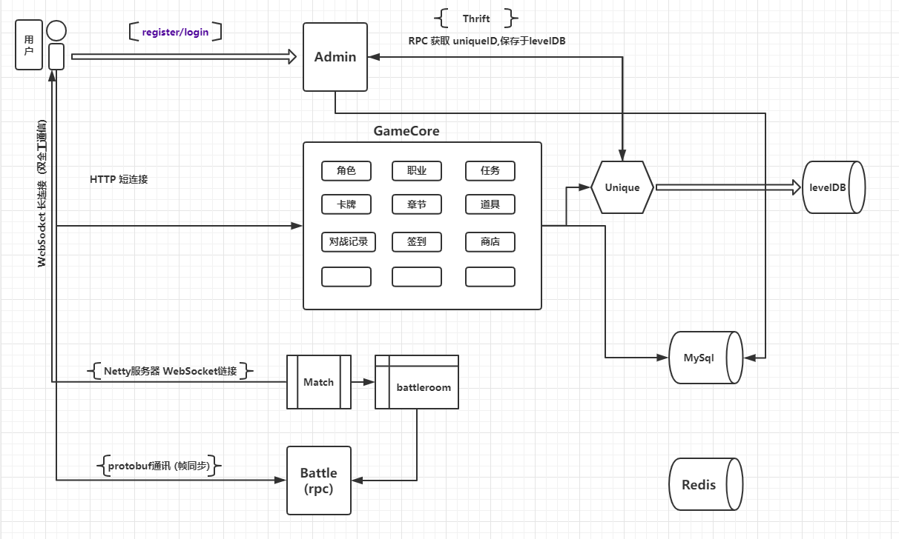

  

## 申明

本项目入驻[**AwakenCN**](https://github.com/AwakenCN)开源组织，后续将继续更新调整，部分API后续会更改，感谢每一位朋友的支持与关注。

## 简介

***(Almost-Famous)Java GameServer Framework***

    Almost-Famous(成名之路) —— 架构使用 -> (
            SpringBoot, Netty, Maven 
        ).explain(多进程分布式框架卡牌游戏开源项目，包括Unique、Login、Game、Battle 四个服务器).

## 项目组织模块

~~~
Root project 'Almost-Famous'
+--- Project ':famous-battle'
+--- Project ':famous-common'
+--- Project ':famous-game'
+--- Project ':famous-login'
\--- Project ':famous-unique'
~~~

* [unique服务的介绍](./famous-unique/README.md)
* [Login服务的介绍](./famous-login/README.md)
* [Game服务的介绍](./famous-game/README.md)
* [Battle服务的介绍](./famous-battle/README.md)

## 项目架构图

## 项目研发日志更新

* [项目研发进度](./famous-static/doc/almost-famous/progress.md)

## 快速开始

1. 使用git下载代码 git clone https://github.com/AwakenCN/Almost-Famous.git;
2. 将代码导入带有maven插件的IDE(推荐使用IntelliJ IDEA);
3. 保证本地安装Maven、mongodb、redis等服务;
4. 启动Unique服务端，入口为RpcServer类;
5. 启动Login服务端，入口为FamousLoginApplication类;
5. 启动Game服务端，入口为FamousGameApplication类;
5. 启动Battle服务端，入口为FamousBattleApplication类;

## 一起交流

    如果您发现bug，或者有任何疑问，请提交issue !!
    或者加入QQ交流群：780465774

* [QQ群 670252084](https://jq.qq.com/?_wv=1027&k=5gXmfE2)

 (Chinese ver.) 持续更新中，保持关注。
