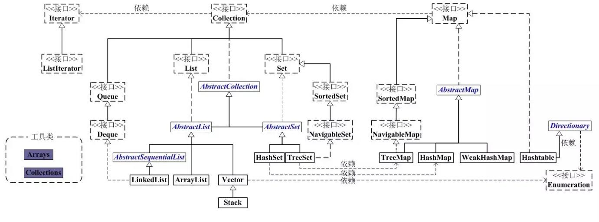

# Java编程 数据结构

## 基本数据类型

|       |       |       |       |       |       |       |       |       |
| :---: | :---: | :---: | :---: | :---: | :---: | :---: | :---: | :---: |
| 数据类型 | byte   |short|int|long|double|float|char|boolean|
| 字节 | 1   |2|4|8|8|4|2|false/true(理论上占用1bit,1/8字节，实际处理按1byte处理)  |

## 常用数据结构

集合类存放于 Java.util 包中，主要有 3 种：set(集）、list(列表包含 Queue）和 map(映射)

    Root Collection<E>
    +--- List<E>
    ---- ArrayList、LinkedList、Vector
    +--- Set<E>
    ---- HashSet、TreeSet

    Root Map<K,V>
    +--- List<E>
    ---- TreeMap、HashMap、Hastable

Java集合系列之并发包（java.util.concurrent）下的高级集合类

    Root Collections
    +--- Queue
    ---- ConcurrentLinkedQueue、BlockingQueue、Deque
        +--- BlockingQueue
        ---- ArrayBlockingQueue、DelayQueue、LinkedBlockingQueue、PriorityBlockingQueue、SynchronousQueue
    
    +--- CopyOnWriteArrayList
    +--- CopyOnWriteArraySet
    +--- ConcurrentSkipListSet
    
    +--- ConcurrentMap
    ---- ConcurrentHashMap、ConcurrentNavigableMap
    
