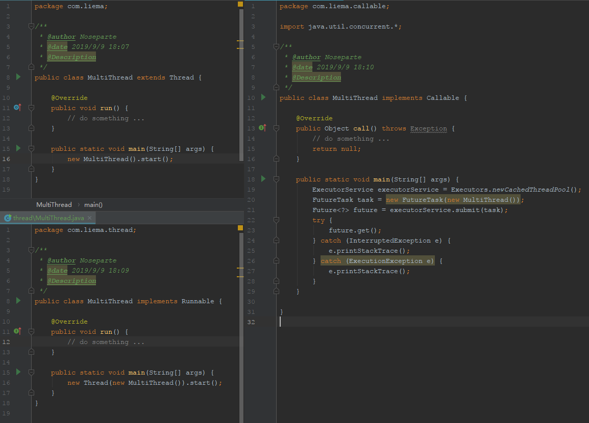

# Java多线程与线程池 (MultiThread and ThreadPool)

## Java中的多线程 MultiThread

- 继承Thread类 
- 实现Runnable接口
- 实现Callable接口



## Java中的线程池(ThreadPool)及其应用场景 

- Executors.newSingleThreadExecutor()
- Executors.newFixedThreadPool(int nThreads)
- Executors.newCachedThreadPool()
- Executors.newScheduledThreadPool()

> https://www.jianshu.com/p/50fffbf21b39

## 多线程中的同步辅助类

- CountDownLatch(计数器)
- CyclicBarrier(线程屏障)
- Phaser() 
- Exchanger() 
- Semaphore(信号量) 


## 应用示例

```java
/**
 * @author Noseparte
 * @date 2019/8/23 16:01
 * @Description
 */
public class ThreadPool {

    protected final static Logger _LOG = LogManager.getLogger(ThreadPool.class);
    private List<ExecutorService> workers = new ArrayList<>();
    private int threadCount;
    private ThreadFactory threadFactory;

    public ThreadPool(int threadCount) {
        this(threadCount, new UserThreadFactory("网关游戏逻辑协议线程池"));
    }

    public ThreadPool(int threadCount, ThreadFactory threadFactory) {
        this.threadCount = threadCount;
        this.threadFactory = threadFactory;
        if (threadCount <= 0 || null == threadFactory)
            throw new IllegalArgumentException();

        for (int i = 0; i < threadCount; i++) {
            workers.add(Executors.newSingleThreadExecutor(threadFactory));
        }
    }

    public Future execute(Runnable task, int mold) {
        int index = Math.abs(mold) % threadCount;
        ExecutorService executor = workers.get(index);
        if (null == executor) {
            _LOG.error("sid=" + mold + ", tid=" + index);
            return null;
        }
        return executor.submit(task);
    }

    public void shutdown() {
        int count = 0;
        for (ExecutorService worker : workers) {
            _LOG.error("close thread{}.", ++count);
            worker.shutdown();
        }
    }

    static class UserThreadFactory implements ThreadFactory {
        private static final AtomicInteger poolNumber = new AtomicInteger(1);
        private final ThreadGroup group;
        private final AtomicInteger threadNumber = new AtomicInteger(1);
        private final String namePrefix;

        UserThreadFactory(String poolName) {
            SecurityManager s = System.getSecurityManager();
            group = (s != null) ? s.getThreadGroup() :
                    Thread.currentThread().getThreadGroup();
            namePrefix = poolName + "-" +
                    poolNumber.getAndIncrement() +
                    "-thread-";
        }

        public Thread newThread(Runnable r) {
            Thread t = new Thread(group, r,
                    namePrefix + threadNumber.getAndIncrement(),
                    0);
            if (t.isDaemon())
                t.setDaemon(false);
            if (t.getPriority() != Thread.NORM_PRIORITY)
                t.setPriority(Thread.NORM_PRIORITY);
            return t;
        }
    }


}

```